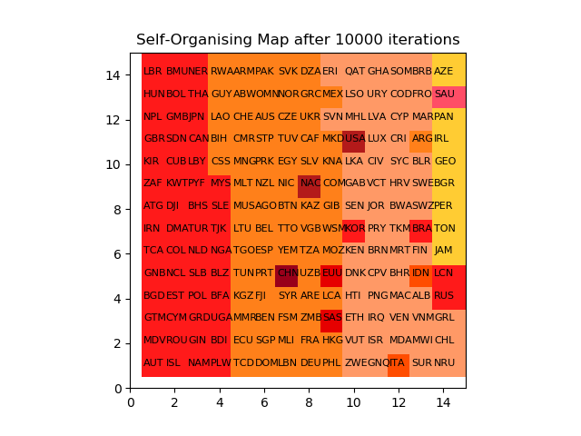
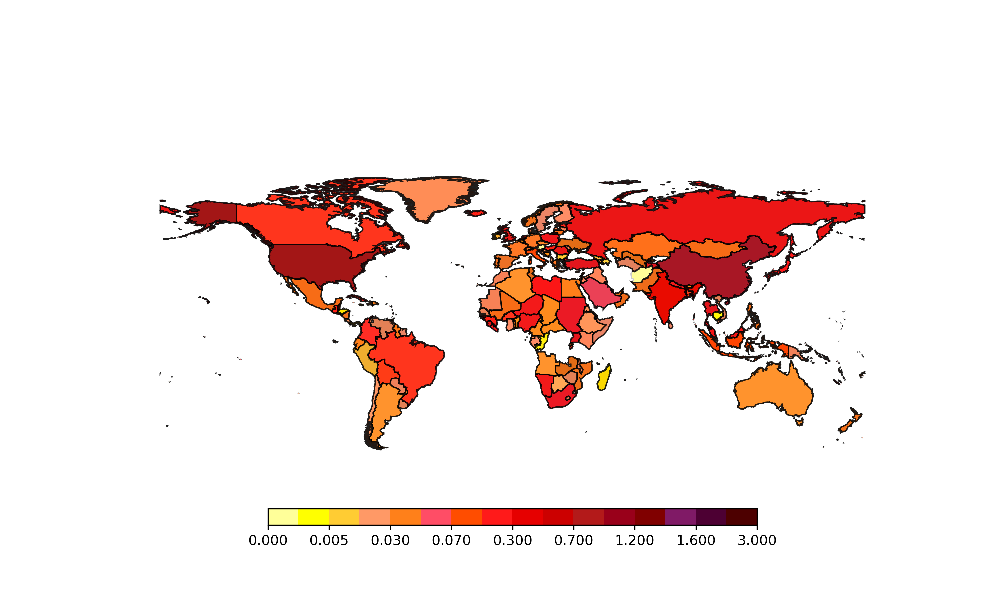

# Greenhouse Gas Prediction with Self-Organizing Maps

This repository is for the course project for CS351 Artificial Intelligence, by the students of Habib University. This project aims to visualize the worldwide effect of greenhouse gases using an unsupervised learning algorithm, Self-Organizing Maps. The results were visualized on a world map as well as a tiled graph. Countries with higher greenhouse gas emission have higher intensity colors as compared to countries with lower greenhouse gas emissions, which can be visualized in the SOM maps.

The results generated from the utilized data are visualized in the tiled graph and world map below.

  
   

## Libraries Used
- numpy
- pandas
- matplotlib
- geopandas
